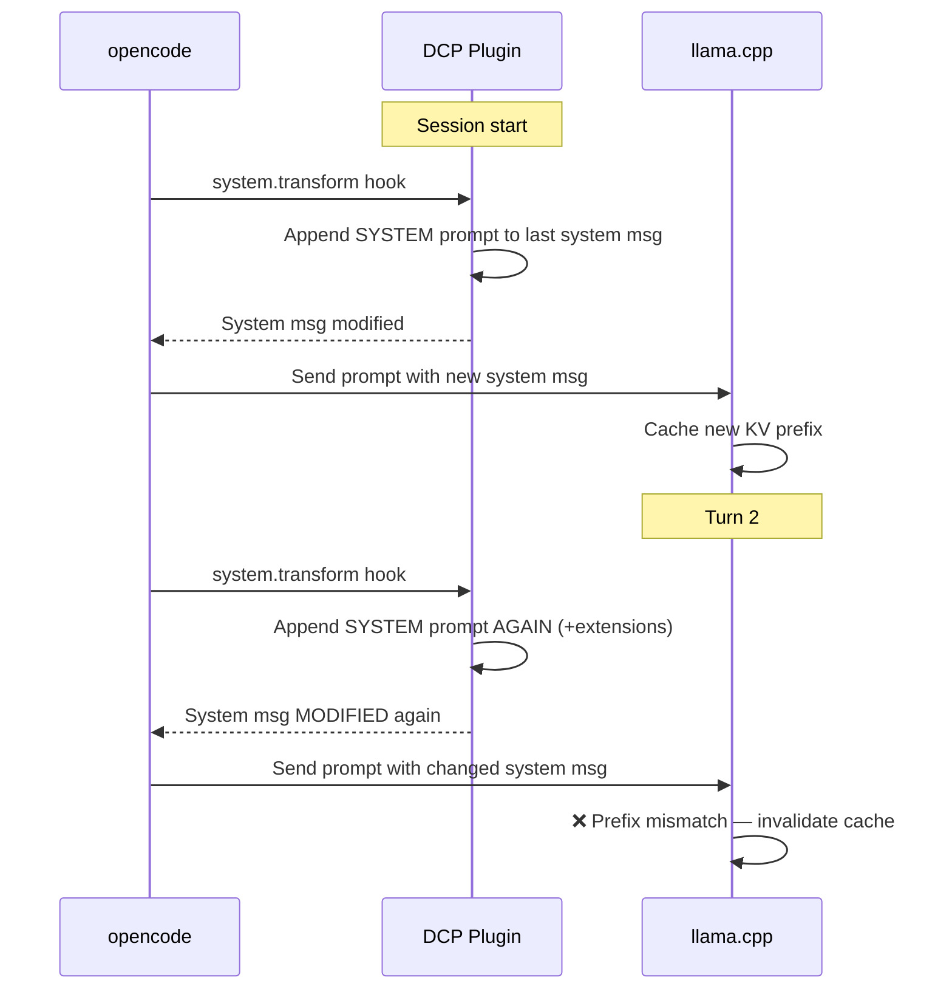
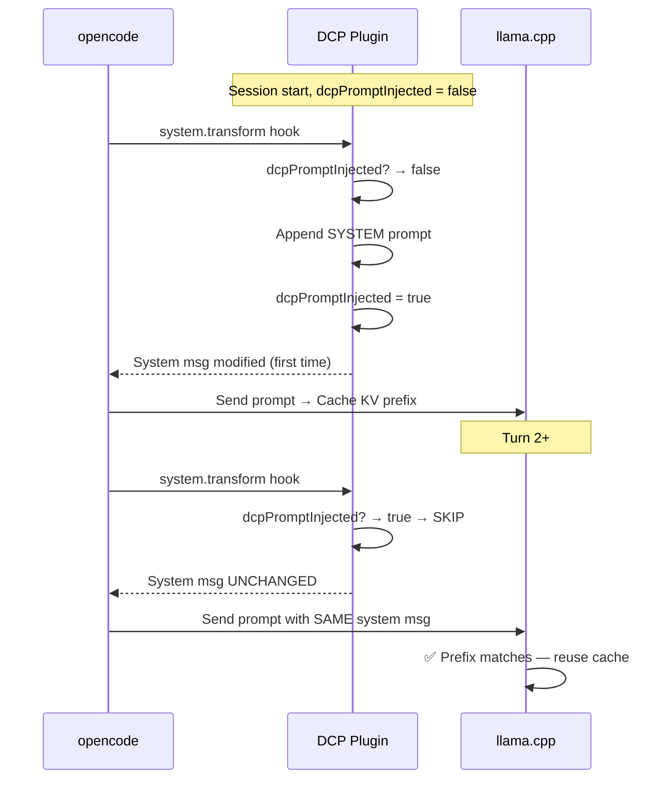

# Specification: DCP System Prompt Deduplication

## Goal

Eliminate llama.cpp KV-cache invalidation caused by the DCP plugin appending its system prompt on every request, by injecting the system prompt only once per session.

## Root Cause

The DCP plugin's `createSystemPromptHandler` (lib/hooks.ts) appends compression instructions + extensions to the last system message on **every request** without deduplication. Changing the system message modifies the prompt prefix, causing llama.cpp to detect a prefix mismatch and force full cache re-processing.

## Architecture

### Before (Cache-Breaking)

### After (Cache-Preserving)

## Data Model

| Field | Type | Default | Description |
|-------|------|---------|-------------|
| `dcpPromptInjected` | `boolean` | `false` | Whether DCP system prompt has been injected this session. Reset on `resetSessionState()`. |

## Implementation

### Phase 1: State Extension (lib/state/types.ts + lib/state/state.ts)

- Add `dcpPromptInjected: boolean` to `SessionState` interface
- Initialize `false` in `createSessionState()` and `resetSessionState()`

### Phase 2: Hook Dedup (lib/hooks.ts)

- After existing early returns (internal agent, permission deny), wrap injection block in `if (!state.dcpPromptInjected) { ... }`
- Move `prompts.reload()` and `renderSystemPrompt()` inside the guard
- Set `state.dcpPromptInjected = true` after injection

## Verification

- **Tests:** 111/111 pass (7 new tests covering full lifecycle)
- **TypeScript:** Clean compilation (`tsc --noEmit`)
- **Code review:** 100% spec compliance, 100% decision compliance

## Risks

| Risk | Impact | Mitigation |
|------|--------|------------|
| Dynamic extensions don't update mid-session | User toggles manual mode but doesn't see manual extension in system prompt | Acceptable — extensions are informational bonuses |
| New session starts but flag not reset | DCP prompt never injected | `resetSessionState()` clears flag |
| Flag not persisted across restarts | Prompt re-injects on next request after restart | Acceptable — restart = new KV cache anyway |
