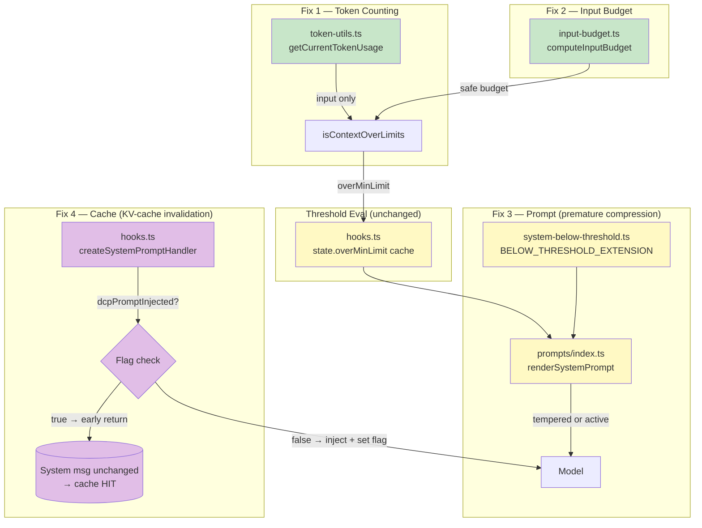

# better-opencode-dcp

## Purpose

A maintained fork of the [Dynamic Context Pruning (DCP) plugin](https://github.com/Tarquinen/opencode-dynamic-context-pruning) (v3.1.12, branch `patched/main`) that fixes premature context compression and prevents llama.cpp KV-cache invalidation.

This fork ensures:
1. Compression respects the configured `minContextLimit` / `maxContextLimit` thresholds by correcting how token usage is measured, how thresholds are computed, and when the model is prompted to compress.
2. The DCP system prompt is injected only once per session, preserving llama.cpp KV-cache reuse across turns.

---

## Four Fixes

The fork applies four coordinated fixes across two problem domains:

### Domain A: Premature Compression (Fixes 1–3)

Three interacting root causes of premature compression (all required — no single fix is sufficient in isolation):

### Fix 1: Input-Only Token Counting

**Problem:** `getCurrentTokenUsage()` summed ALL token types (input + output + reasoning + cache read + cache write), inflating the reported context size by ~20–25%. Compression triggered at ~62–65% actual usage when 80% was configured.

**Solution:** Return only `assistantInfo.tokens.input` — the same value opencode uses for its `contextTokens` tracking (`session.ts:429`). Output, reasoning, and cache tokens don't occupy the context window sent to the model.

```typescript
// BEFORE:      return input + output + reasoning + cacheRead + cacheWrite  ← inflated by ~25%
// AFTER:       return assistantInfo.tokens?.input || 0                     ← input only
```

**File:** `lib/token-utils.ts` — single-line change

### Fix 2: Input Budget Calculation

**Problem:** The original plugin compared percentages against the model's full `limit.context` (e.g., 1M for Claude). But output tokens share the same pool — compressing against the full context lets the model produce a response that pushes actual usage over the limit.

An upstream fix (commit 4a5a1b5) correctly changed to use the safe input budget, but was then reverted (5bb0fe4), restoring the broken behavior.

**Solution:** Introduce `computeInputBudget()` that calculates the safe input budget:

- **Split-budget models** (OpenAI GPT-5 line): use `limit.input` directly
- **Shared-pool models** (Anthropic, gpt-4o, Gemini, Grok): use `limit.context - limit.output`

```typescript
// claude-opus-4-7:   1M - 128K = 872K input budget     (80% → 697K, was 800K)
// gpt-5.4-mini:      272K input directly                 (80% → 217K, was 320K)
// gpt-4o:            128K - 16K = 112K input budget      (80% → 89K, was 102K)
```

**File:** `lib/input-budget.ts` (NEW) — pure function, O(1)

### Fix 3: Threshold-Aware System Prompt

**Problem:** The DCP system prompt told the model to "compress when sections are closed" on **every** request, regardless of whether thresholds were reached. This gave the model unconditional permission to compress at any context level.

**Solution:** Add a below-threshold extension that tempers compression guidance when context is below `minContextLimit`. The model receives:

- **Below threshold:** "Context usage is currently below the configured threshold. You may compress if a section is clearly closed, but prioritize keeping raw context available for active work."
- **At/above threshold:** The standard active compression guidance.

**Files:** `lib/prompts/extensions/system-below-threshold.ts` (NEW), `lib/prompts/index.ts`, `lib/prompts/store.ts`

### Domain B: KV-Cache Performance (Fix 4)

### Fix 4: System Prompt Deduplication (Session-Level Flag)

**Problem:** The DCP plugin's `createSystemPromptHandler` appends the DCP system prompt to the last system message on **every request** without deduplication. This changes the prompt prefix on every turn, causing llama.cpp to detect a prefix mismatch, invalidate its KV cache, and force full prompt re-processing. The log shows:

```
W slot update_slots: id 0 | task 2483 | forcing full prompt re-processing
W slot update_slots: id 0 | task 2483 | erased invalidated context checkpoint
  (pos_min = 108456, pos_max = 108456, n_tokens = 108457, ...)
```

The token count mismatch (~108K cached vs ~55K new) confirms the prompt structure changed significantly between turns.

**Solution:** Add a `dcpPromptInjected: boolean` flag to `SessionState` to track whether the system prompt has been injected. On the first request, the flag is `false`, so the prompt is injected normally, then the flag is set to `true`. On all subsequent requests, the guard `if (!state.dcpPromptInjected) return` skips the injection — the system message remains unchanged, and llama.cpp's KV cache stays valid.

```typescript
// lib/hooks.ts — createSystemPromptHandler
if (!state.dcpPromptInjected) {
    prompts.reload()
    const runtimePrompts = prompts.getRuntimePrompts()
    const newPrompt = renderSystemPrompt(/* ... */)
    output.system[output.system.length - 1] += "\n\n" + newPrompt
    state.dcpPromptInjected = true  // ← set after first injection
}
// Subsequent calls: state.dcpPromptInjected is true → early return
```

**Design choices:**
- **Flag, not content check:** A session-level boolean is simpler than `includes()` string matching. Content checks would re-inject when dynamic extensions change (manual mode toggle, threshold notifications).
- **Reset on session reset:** `resetSessionState()` clears `dcpPromptInjected`, ensuring a new session re-injects.
- **`prompts.reload()` inside guard:** Avoids unnecessary I/O and string building on every turn.

**Files:** `lib/state/types.ts`, `lib/state/state.ts`, `lib/hooks.ts`

---

## Why Each Fix Is Required

No single fix addresses all issues:

### Domain A: Premature Compression (Fixes 1–3)

These three fixes are tightly coupled — all must be present to prevent premature compression:

| Scenario | Fix 1 Only | Fix 2 Only | Fix 3 Only | All Three |
|----------|-----------|-----------|-----------|-----------|
| Inflated token count | ✅ Fixed | ❌ Inflated | ❌ Inflated | ✅ Fixed |
| Wrong threshold base | ❌ Still full context | ✅ Fixed | ❌ Still full context | ✅ Fixed |
| Unconditional compress prompt | ❌ Still unconditional | ❌ Still unconditional | ✅ Tempered | ✅ Tempered |
| **Result: premature compression** | **❌** | **❌** | **❌** | **✅ No** |

### Domain B: KV-Cache Performance (Fix 4)

Fix 4 is independent of Fixes 1–3. It addresses a separate problem — cache invalidation — and does not interact with the compression threshold logic:

| Scenario | Fix 4 Only | Fix 1–3 Only | All Four |
|----------|-----------|--------------|----------|
| KV-cache invalidated on every turn | ✅ Fixed | ❌ Invalidated | ✅ Fixed |
| Premature compression | ❌ Unchanged | ✅ Fixed | ✅ Fixed |

---

## File Inventory

### New Files (4)

| File | Purpose |
|------|---------|
| `lib/input-budget.ts` | `computeInputBudget()` — safe input token budget calculation |
| `lib/prompts/extensions/system-below-threshold.ts` | `BELOW_THRESHOLD_EXTENSION` — below-threshold compression guidance |
| `tests/input-budget.test.ts` | 9 unit tests for `computeInputBudget` (edge cases, shared-pool, split-budget) |
| `tests/token-utils.test.ts` | 3 unit tests for input-only token counting |

### Modified Files (14)

| File | Change | Fix |
|------|--------|-----|
| `lib/hooks.ts` | (a) Use `computeInputBudget` instead of raw `limit.context`; (b) Cache `overMinLimit` on state; (c) Pass `state.overMinLimit` to `renderSystemPrompt`; (d) Add `dcpPromptInjected` dedup guard | 2, 3, **4** |
| `lib/prompts/index.ts` | Add `overMinLimit?: boolean` parameter to `renderSystemPrompt`; conditionally append below-threshold extension | 3 |
| `lib/prompts/store.ts` | Add `belowThresholdExtension` to `RuntimePrompts` interface and internal prompt extensions | 3 |
| `lib/state/types.ts` | Add `overMinLimit?: boolean` and `dcpPromptInjected: boolean` to `SessionState` interface | 3, **4** |
| `lib/state/state.ts` | Initialize `overMinLimit: undefined`, `dcpPromptInjected: false` in `createSessionState()` and `resetSessionState()` | 3, **4** |
| `lib/token-utils.ts` | `getCurrentTokenUsage` returns only `input` tokens (single-line change) | 1 |
| `tests/hooks-permission.test.ts` | Update expectation from full context to computed input budget; add 7 dedup lifecycle tests | 2, **4** |
| `tests/prompts.test.ts` | Add 4 tests for below-threshold extension behavior | 3 |
| `tests/token-usage.test.ts` | Update 4 test calibrations from sum-of-all to input-only values | 1 |
| `.vault/concepts/0001-dynamic-context-pruning.concept.md` | Updated with overlay mechanism docs and corrected token-counting semantics | — |
| `.vault/memories/_index.md` | Index updated to include new atomic memories | — |

---

## Architecture

### Data Flow (After All Four Fixes)

```
Domain A — Premature Compression (Fixes 1–3):
1. Input budget:    computeInputBudget(model.limit)       → safe input token budget
   └─ split-budget (limit.input) or shared-pool (context - output)

2. Token counting:  getCurrentTokenUsage(messages)        → input tokens only
   └─ returns assistantInfo.tokens?.input || 0 (not sum of all types)

3. Threshold eval:  isContextOverLimits(config, state, ...) → { overMaxLimit, overMinLimit }
   └─ compares input tokens against input budget (apples-to-apples)

4. State cache:     state.overMinLimit = overMinLimit     → cached for system prompt handler
   └─ recomputed every chat transform (never stale)

5. Prompt render:   renderSystemPrompt(..., overMinLimit) → threshold-aware guidance
   └─ below-threshold: "prioritize keeping context available" extension
   └─ at/above-threshold: standard compression guidance (no change)

Domain B — KV-Cache Performance (Fix 4):
6. System hook:     createSystemPromptHandler fires on every request
   └─ state.dcpPromptInjected? → true → early return (skip injection)
   └─ state.dcpPromptInjected? → false → inject, set flag to true
   └─ Result: system message is modified ONCE per session
```

### Component Map



*Green = Fix 1 & 2 (input fixes). Yellow = Fix 3 (prompt fix). Purple = Fix 4 (cache fix).*

---

## Installation

### Prerequisites

- **opencode** — The forked DCP plugin requires opencode to be installed and running.

### Install from Fork (Recommended)

```bash
# Install the forked plugin from local repo
cd ~/www/misc/better-opencode-dcp
npm install
npm run build

# Link to opencode's plugin directory
opencode plugin install ~/www/misc/better-opencode-dcp --global
```

### Install via npm (once published)

```bash
opencode plugin @oleksii-honchar/better-opencode-dcp@latest --global
```

---

## Usage

### Configuration

No configuration changes are required — the fork works with your existing DCP config:

```jsonc
// ~/.config/opencode/dcp.jsonc
{
  "compress": {
    "minContextLimit": "80%",
    "maxContextLimit": "95%",
    "permission": "allow",
    "mode": "range"
  }
}
```

All three fixes are transparent — the configured thresholds now work correctly.

### Verification

With the fork installed, compression should only trigger when actual input tokens exceed your configured `minContextLimit`:

| Model | Context | Input Budget | 80% Threshold | Old Trigger (broken) |
|-------|---------|-------------|---------------|---------------------|
| claude-opus-4-7 | 1M | 872K | 697K | 640K input |
| gpt-5.4-codex | 400K | 272K | 217K | 200K input |
| gpt-4o | 128K | 112K | 89K | 82K input |

Check your actual threshold with:
```
/dcp context   ← shows token usage breakdown
/dcp stats     ← shows cumulative compression statistics
```

### What Changed Behaviorally

| Behavior | Before (Upstream) | After (Fork) |
|----------|------------------|--------------|
| Token count includes? | input + output + reasoning + cache | input only |
| Threshold base | `limit.context` (full context) | `computeInputBudget` (safe input) |
| System prompt unconditionally encourages? | Yes — always | No — tempered below threshold |
| System prompt appended every turn? | Yes — cache invalidated | No — once per session (cache preserved) |
| Typical trigger at 80% setting | ~62-65% actual usage | ~80% actual usage ✅ |
| llama.cpp KV cache on turn 2+ | ❌ Invalidated (full reprocessing) | ✅ Reused (cache hit) |

The model still compresses when context is high — it just stops compressing prematurely.

---

## Compatibility

This fork is **fully backward-compatible** with the original DCP plugin. All config options, behavior, and the compress tool work identically — the only change is that token thresholds now correctly reflect actual context usage.

No changes are required to your existing DCP configuration, opencode setup, or OpenChamber config.

---

## Testing

The fork includes **111 tests** (all passing):

| Test File | Tests | What It Covers |
|-----------|-------|----------------|
| `tests/token-utils.test.ts` | 3 | Fix 1: input-only counting, no tokens, compaction |
| `tests/input-budget.test.ts` | 9 | Fix 2: shared-pool, split-budget, zero, missing fields, negative prevention |
| `tests/prompts.test.ts` | 4+7 | Fix 3: below-threshold behavior with all extension combinations |
| `tests/hooks-permission.test.ts` | modified + 7 new | Fix 2: computed input budget; **Fix 4: dedup lifecycle** (flag default, reset, guard skips, empty system array, flag already true, lifecycle inject→reset→inject, internal agent skip) |
| `tests/token-usage.test.ts` | modified | Fix 1: all calibrations use input-only values |

```bash
npm test          # Run all tests (requires Node.js + tsx)
cd ~/www/misc/better-opencode-dcp && npm test
# Expected: ℹ tests 111 | ℹ pass 111 | ℹ fail 0

npm run typecheck # Verify types
```

---

## Upstream Sync

The upstream DCP plugin is at [Tarquinen/opencode-dynamic-context-pruning](https://github.com/Tarquinen/opencode-dynamic-context-pruning).

To sync with upstream:

```bash
cd ~/www/misc/better-opencode-dcp

# Add upstream remote (one-time setup)
git remote add upstream git@github.com:Tarquinen/opencode-dynamic-context-pruning.git

# Fetch and rebase
git fetch upstream
git rebase upstream/master
```

**Note:** The upstream remote is pre-configured in this repo. Verify with `git remote -v`.

---

## License

AGPL-3.0 — Same as upstream DCP.
